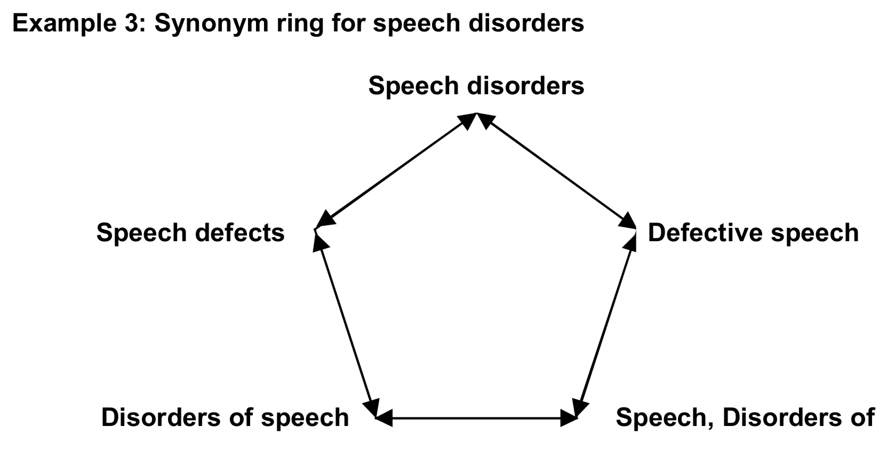

= Types of Models
Bart Kleijngeld <bart.kleijngeld@alliander.com>
0.1, July 16, 2025
:version: 0.1
:gh-repo-name: Netbeheer-Nederland/doc-nbea-data-modeling-advisory-report

Author::
    mailto:bart.kleijngeld@alliander.com[Bart Kleijngeld] (Alliander)
Editors::
    mailto:bart.kleijngeld@alliander.com[Bart Kleijngeld] (Alliander) +
    mailto:bart.kleijngeld@alliander.com[Bart Kleijngeld] (Alliander)
Version::
    {version}
Feedback::
https://github.com/{gh-repo-name}/issues[Issue on GitHub] (https://github.com/{gh-repo-name}[`{gh-repo-name}`])

'''

This document proposes a thesaurus which describes the different kinds of models to be used by Dutch grid operators.

== Controlled vocabularies

Controlled vocabularies ^<<ANSI-NISO-Z3919>>^ are defined as follows.

[quote,ANSI/NISO Z39.19, Section ]

=== List

[quote,ANSI/NISO Z39.19, Section 5.4.1]
--
A list (also sometimes called a pick list) is a limited set of terms arranged as a simple alphabetical list or in some other logically evident way. Lists are used to describe aspects of content objects or entities that have a limited number of possibilities. Examples include geography (e.g., country, state, city), language (e.g., English, French, Swedish), or format (e.g., text, image, sound).
--

[%collapsible]
.Simple alphabetical list
====
* Alabama
* Alaska
* Arkansas
* California
* Connecticut
* Delaware
====

[%collapsible]
.Simple logical list
====
* Mercury
* Venus
* Earth
* Mars
* Jupiter
* Saturn
* Uranus
* Neptune
* Pluto
====

=== Synonym ring

[quote,ANSI/NISO Z39.19, Section 5.4.2]
--
While a synonym ring is considered to be a type of controlled vocabulary, it plays a somewhat different role than the other types covered by this Standard. Synonym rings cannot be used during the indexing process. Rather, they are used only during retrieval. Use of synonym rings ensures that a concept that can be described by multiple synonymous or equivalent terms will be retrieved if any one of the terms is used in a search.

A synonym ring, therefore, is a set of terms that are considered equivalent for the purposes of retrieval. Synonym rings usually occur as sets of flat lists. A synonym ring allows users to access all content objects or database entries containing any one of the terms. Synonym rings are generally used in the interface in an electronic information system, and provide access to content that is represented in natural, uncontrolled language.
--

==== Examples

[%collapsible]
.Synonym ring for speech disorders
====

====

=== Taxonomy

[quote,ANSI/NISO Z39.19, Section 5.4.3]
--
A taxonomy is a controlled vocabulary consisting of preferred terms, all of which are connected in a hierarchy or polyhierarchy.
--

==== Examples

[%collapsible]
.Taxonomy hierarchy
====
* chemistry
** physical chemistry
*** electrochemistry
**** magnetohydrodyamics
====

=== Thesaurus

[quote,ANSI/NISO Z39.19, Section 5.4.4]
--
A thesaurus is a controlled vocabulary arranged in a known order and structured so that the various relationships among terms are displayed clearly and identified by standardized relationship indicators.

Relationship indicators *should* be employed reciprocally.
--

==== Examples

[%collapsible]
.Print thesaurus entry
====
#TODO#.
====

== Data and information models

[bibliography]
== References

* [[[ANSI-NISO-Z3919]]] ANSI/NISO Z39.19-2005 (R2010)

[glossary]
== Glossary

[glossary]
controlled vocabulary:: A list of terms that have been enumerated explicitly. This list is controlled by and is available from a controlled vocabulary registration authority. All terms in a controlled vocabulary must have an unambiguous, non-redundant definition. +
NOTE: This is a design goal that may not be true in practice; it depends on how strict the controlled vocabulary registration authority is regarding registration of terms into a controlled vocabulary. +

At a minimum, the following two rules must be enforced: +

1. If the same term is commonly used to mean different concepts,
then its name is explicitly qualified to resolve this ambiguity. +
+
NOTE: This rule does not apply to synonym rings. +
2. If multiple terms are used to mean the same thing, one of the
terms is identified as the preferred term in the controlled
vocabulary and the other terms are listed as synonyms or
aliases.